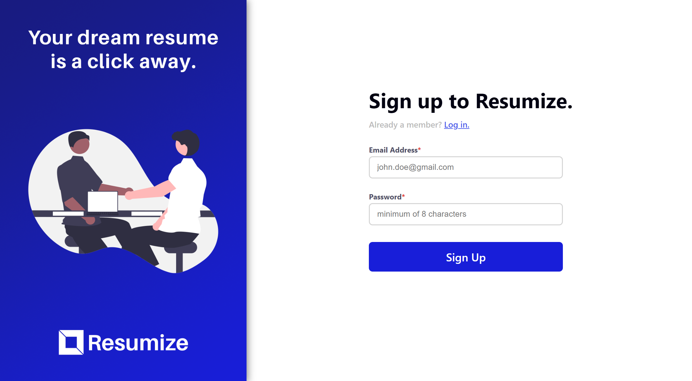
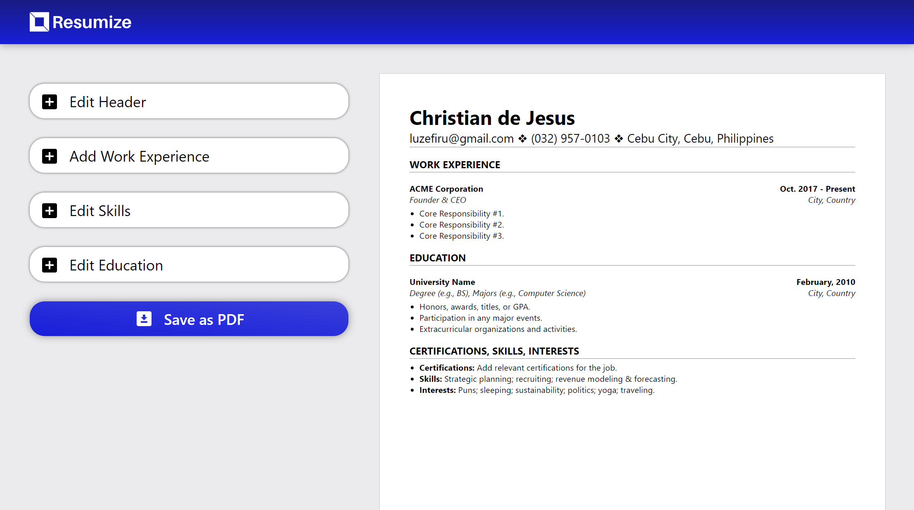

# Resumize


A simple CV Creation & `.pdf` Exporter App based on [/u/SheetsGiggles](https://www.reddit.com/user/SheetsGiggles/)'s CV template with Firebase User Authentication & Firestore data persistence.

# Using Firebase Authentication & Firestore

Google's Firebase is a Backend-as-a-Service (BaaS) that allowed me to create seamless user authentication & data storage.

I created a utility module that would export the `auth` and `db` service Objects that would serve as the interface for the other functions.

## Initializing the Services

```js
/* firebase.config.js */
import { initializeApp } from 'firebase/app';
import { getAuth, connectAuthEmulator } from 'firebase/auth';
import { getFirestore, connectFirestoreEmulator } from 'firebase/firestore';

// Initialize Firebase
const app = initializeApp(firebaseConfig);
// Initialize Firebase Auth service
const auth = getAuth(app);
// Initialize Firebase Firestore service
const db = getFirestore(app);

// Initialize Emulators for development purposes, run with: firebase emulators:start
connectAuthEmulator(auth, 'http://localhost:9099');
connectFirestoreEmulator(db, 'localhost', 8080);

export { app, auth, db };
```

## Authentication

The `onAuthStateChanged(auth, () => {})` function acts as an [Observer](https://www.dofactory.com/javascript/design-patterns/observer) that listens to any changes to the `auth` service.

When the user logs in or out with the `createUserWithEmailAndPassword(auth, email, password)`, `signInWithEmailAndPassword(auth, email, password)`, and `signOut(auth)` `async` functions, it triggers the callback function of `onAuthStateChanged()` to fire, allowing me to set different states to render different components via React.

```js
/* Auth.jsx */
import { auth } from '../../firebase-config.js';
import { onAuthStateChanged } from 'firebase/auth';

const [loggedIn, setLoggedIn] = useState(false);
let userID;

try {
  userID = auth.currentUser.uid;
} catch (error) {
  userID = null;
}

// listen to auth state changes and set state accordingly to conditionally render <App />
onAuthStateChanged(auth, (user) => {
  if (user !== null) {
    setLoggedIn(true);
    userID = user.uid;
  } else {
    setLoggedIn(false);
    userID = null;
  }
});
```

## Firestore

Data persistence of the Resume fields was accomplished with Firestore. The data is fetched when `<App />` is mounted and the entire `this.state` object is saved to the Firestore database.

It is a pattern to `const docSnapshot = await getDoc(doc(db, "pathTo/document"))` at component mount, then `await setDoc(doc(db, "pathTo/document"))` when data needs to be updated either `onChange` or `onClick` of a `<button type="submit">`.

```js
/* App.jsx */

componentDidMount() {
    // gets the resume data and re-renders the page accordingly
    getFormData(this.props.userID, this.state, this.setState.bind(this));
  }

  componentDidUpdate() {
    // saves the resume data into the Firebase Firestore for future retrieval
    setFormData(this.props.userID, this.state);
  }

...

/**
 * Fetches data from the Firestore service and sets the state to the corresponding data.
 *
 * @param {string} userID - the unique User ID of the current authenticated user
 * @param {object} state - the current state of the resume to save in setFormData
 * @param {function} setState - the this.setState function to update form data with
 */
async function getFormData(userID, state, setState) {
  const docSnapshot = await getDoc(doc(db, `resumes/${userID}`));
  if (docSnapshot.exists()) {
    // display the data of the firestore's resume to the current window
    setState(docSnapshot.data());
  } else {
    // otherwise use the default template to create the resume in the Firestore Database
    setFormData(userID, state);
  }
}

/**
 * Sets the userID as a key to a value containing an object with the form data.
 *
 * @param {string} userID - the unique User ID of the current authenticated user
 * @param {object} state - the current state of the resume to save
 */
async function setFormData(userID, state) {
  await setDoc(doc(db, `resumes/${userID}`), state);
}
```

# Accomplishing `.html` to `.pdf` Exports

In order to export HTML containers as a `.pdf`, I used a library called [jsPDF](https://github.com/parallax/jsPDF) for the formatting of the document.

This library alone would suffice for generic prints, however, since my CV formatting requires UTF-8 characters, I had to use another library called [html2canvas](https://github.com/niklasvh/html2canvas) which generates a `.png` screenshot of any HTML element, including the CSS styles before exporting it into a `.pdf`.

The code snippet below for a function `createPDF` selects an element with the `id="pdf"` attribute and exports it (including its children) as a `.pdf`, ignoring any elements not included in its parental scope.

```js
import { jsPDF } from 'jspdf';
import html2canvas from 'html2canvas';

createPDF = async () => {
  const pdf = new jsPDF('portrait', 'px', [1056, 816]); // A4 paper sizing in pixels
  const data = await html2canvas(document.querySelector('#pdf'));
  const img = data.toDataURL('image/png');
  const imgProperties = pdf.getImageProperties(img);
  const pdfWidth = pdf.internal.pageSize.getWidth();
  const pdfHeight = (imgProperties.height * pdfWidth) / imgProperties.width;
  pdf.addImage(img, 'PNG', 0, 0, pdfWidth, pdfHeight);
  const name = `${this.state.headerDetails.fName}_${this.state.headerDetails.lName}`;
  pdf.save(`${name}_Resume_by_Resumize.pdf`);
};
```

# Testing

The following lines of code allow the local machine to host emulators for the added Firebase services.

> The Firebase Firestore emulator requires a Java JDK to be installed in the local machine with a `JAVA_HOME` Environment Variable set to the `jdk-<version>/bin/` directory of the installed Java JDK.

```js
/* firebase.config.js */

// Initialize Emulators for development purposes, run with: firebase emulators:start
connectAuthEmulator(auth, 'http://localhost:9099');
connectFirestoreEmulator(db, 'localhost', 8080);
```

```bash
# start the firebase emulators for Authentication & Firestore
firebase emulators:start
# start the local live server with webpack to automatically recompile code for development
npm run start
```

# Output

### [Visit the Website Here](https://resumize-9630a.web.app/)




# Reference

These were the requirements in The Odin Project's [Project: CV Application](https://www.theodinproject.com/lessons/node-path-javascript-cv-application) site in order to serve as a capstone project for ReactJS `props` & `state`.
