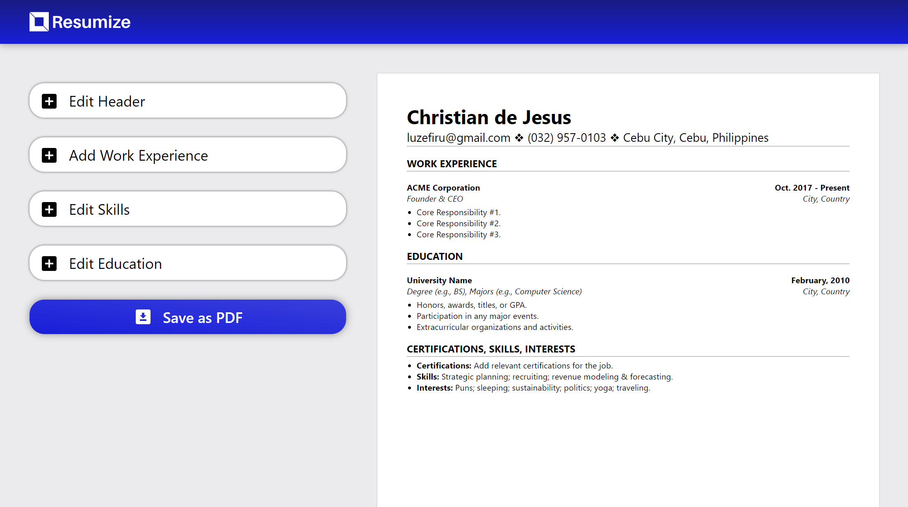

# resumize

A simple CV Creation & `.pdf` Exporter App based on [/u/SheetsGiggles](https://www.reddit.com/user/SheetsGiggles/)'s CV template.

# Accomplishing `HTML` to `.pdf` Exports

In order to export HTML containers as a `.pdf`, I used a library called [jsPDF](https://github.com/parallax/jsPDF) for the formatting of the document.

This library alone would suffice for generic prints, however, since my CV formatting requires UTF-8 characters, I had to use another library called [html2canvas](https://github.com/niklasvh/html2canvas) which generates a `.png` screenshot of any HTML element, including the CSS styles before exporting it into a `.pdf`.

The code snippet below for a function `createPDF` selects an element with the `id="pdf"` attribute and exports it (and its children) as a `.pdf`, ignoring any elements not included in its parental scope.

```js
import { jsPDF } from 'jspdf';
import html2canvas from 'html2canvas';

createPDF = async () => {
  const pdf = new jsPDF('portrait', 'px', [1056, 816]); // A4 paper sizing in pixels
  const data = await html2canvas(document.querySelector('#pdf'));
  const img = data.toDataURL('image/png');
  const imgProperties = pdf.getImageProperties(img);
  const pdfWidth = pdf.internal.pageSize.getWidth();
  const pdfHeight = (imgProperties.height * pdfWidth) / imgProperties.width;
  pdf.addImage(img, 'PNG', 0, 0, pdfWidth, pdfHeight);
  const name = `${this.state.headerDetails.fName}_${this.state.headerDetails.lName}`;
  pdf.save(`${name}_Resume_by_Resumize.pdf`);
};
```

# Output

### [Visit the Website Here](https://luzefiru.github.io/resumize/)



# Requirements

These were the requirements in The Odin Project's [Project: CV Application](https://www.theodinproject.com/lessons/node-path-javascript-cv-application) site in order to serve as a capstone project for ReactJS `props` & `state`.
